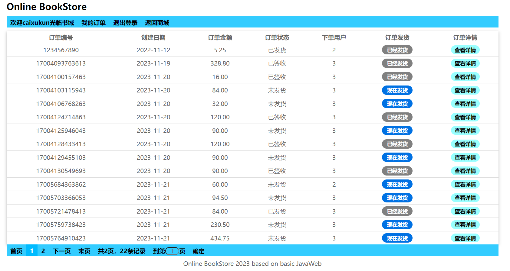

## JavaWeb书城项目
<body style="font-family: KaiTi">
本项目是尚硅谷2020年版的JavaWeb教程的项目，用于记录本人JavaWeb之学习过程。
所以项目中包含大量的使用注释记下的课程笔记。

涉及到的技术、服务器及数据库包括 
JavaSE + Servlet + Tomcat + JDBC + MySQL + jsp + js + Cookie + Session +
Filter + AJAX + HTML + CSS。目前，这些技术几乎皆已过时，尤其是jsp这种，可维护性很差，很容易将页面代码写得乱七八糟。
现代项目更青睐于前后端分离，后端只需要专注服务器业务逻辑，把数据以JSON格式传给前端即可。

但正所谓“硫酸恒久远，一杠永流传”，JavaWeb相关技术是后续学习
春天(Spring)及春靴(SpringBoot)的基础。正如无论大厂用何种开发语言框架，高校都会教经典的C语言和计算机四大件一样，这些C语言和底层知识可能在工作中不会用到，但属于“内功”。
了解了基础，才能更好地了解框架的迭代演变，知其然，亦知其所以然。

原有书城项目资料可以从哔哩哔哩相关课程下面的评论区下载到。

注意：本项目在不少地方用到了反射。反射本质是使用类的字节码文件构造类的对象/调用类的方法等。
在该项目中，反射最主要的应用场景就是设计 BaseServlet，它专门用于处理 doGet/doPost，以便于其它 Servlet 程序只需要写业务方法，再继承BaseServlet即可，无需写 doGet/doPost。
例如：UserServlet 继承了 BaseServlet，UserServlet 的 login 方法
可以在 BaseServlet 的 doGet 中传入 "login" 这个字符串后对 login 方法进行访问。

相比于原来项目，在学习过程中进行了少量扩充：

- 订单 Order 模块的完善，加入了商品库存功能，下单可以减少商品库存
- 重新设计了前端界面(当然，看着也就那样)，以巩固HTML+CSS这些前端知识，也方便以后更好地编辑公众号(事实上，公众号的各个排版也是由前端技术完成的)
- 包管理是基于Maven的，Maven是简单、易用、具有普适性的Java包管理工具
- 分页条的写法与课程中有所不同，或许更为简单，但写得比较混乱

该项目还有如下可以优化的地方：

- 管理员账户应该和用户账户分开
- 如果希望减少 xml 配置 Servlet 程序，应该使用注解方式进行配置，下面是对HelloServlet配置的示例。 
这里的注解会保留到运行时，Tomcat容器会通过反射读取该注解的参数及参数值。
```
@WebServlet(name = "helloServlet", value = "/hello-servlet")
```

前端优化后的界面效果如下：


</body>